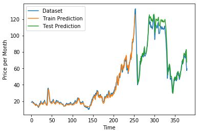

# Crude_Oil_Prediction_Using_ANN

**I use Dataset with time series type and the output that we expected is Price od crude oil**

**Datatrain available in Europe_Oil_Price.csv**

### I do predict with ANN algorithm and using Linear Regression concept

**I got loss equal to 0.00005 = 0.05%**

### Tools that needed to be installed are :
- Keras version 2.2.4
- Tensorflow version 1.13.0-rc2
- Pandas version 0.23.4
- Numpy version 1.16.1
- Matplotlib version 2.2.3

### Split dataset and lookback
I use 67% of dataset to data X and 33% to data Y. And also because this data is time series type, so i use lookback = 3. Lookback is how much data we use to predict one data. Of course all data still have to be fit to ann, but we have to predict with specified lookback to make data more acurate.

### I use Input layer = 64, Hidden layer = 8, Hidden layer = 8, Hidden layer = 8, Output layer = 1 and the result of crude oil predicition describe with image below 

blue line is the real dataset, orange line is testX, and green line is testY

